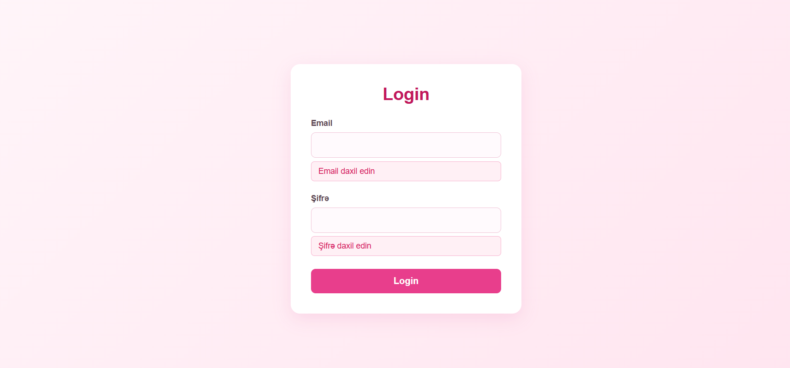
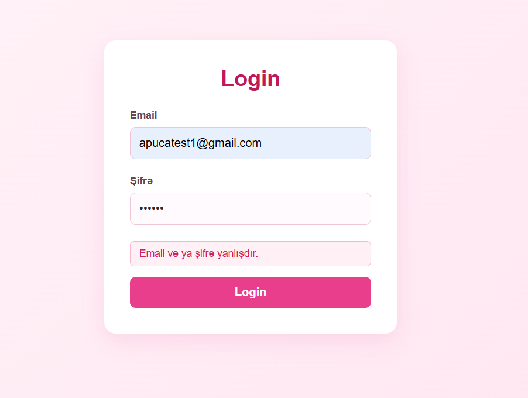
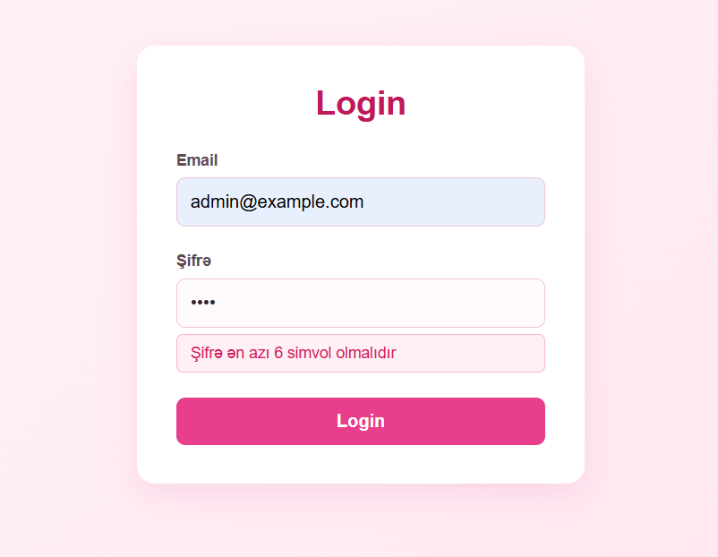
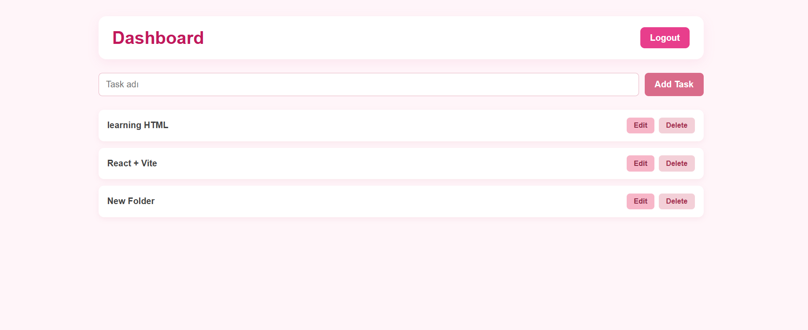
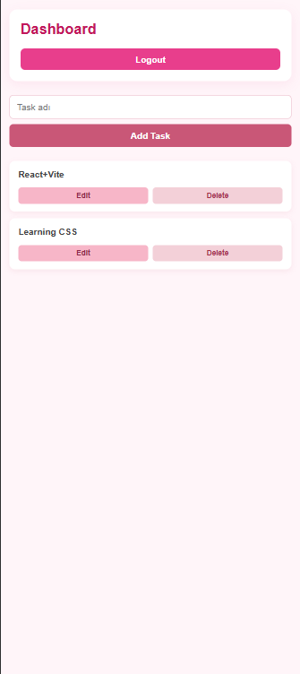

# Task Manager

Task Manager istifadəçilərin daxil olub öz tapşırıqlarını idarə edə bildiyi React layihəsidir. Layihədə istifadəçi autentifikasiyası, qorunan route-lar, taskların əlavə edilməsi, redaktə edilməsi və silinməsi, Mock API ilə məlumat mübadiləsi və xəta idarəetməsi həyata keçirilib.

Layihəni hazırlayarkən React, React Router, Context API, useReducer, useEffect, useState və JSON Server kimi texnologiyalardan istifadə etmişəm.

---

## Layihənin əsas imkanları

Layihədə aşağıdakı funksionallıqlar hazırlanıb:

- Login sistemi
- Token əsaslı autentifikasiya
- Token-in localStorage-da saxlanılması
- Token expiration
- Protected Route
- Dashboard səhifəsi
- Taskların API-dən yüklənməsi
- Yeni task əlavə etmək
- Mövcud taskı redaktə etmək
- Task silmək
- Optimistic UI
- Loading vəziyyəti
- Empty state
- Error Boundary
- Feature-based kod strukturu
- Responsive və sadə istifadəçi interfeysi

---

## İstifadə olunan texnologiyalar

- React
- JavaScript
- React Router DOM
- React Context API
- useReducer
- useState
- useEffect
- JSON Server
- REST API
- CSS
- Vite

---

## Autentifikasiya

Layihədə istifadəçi giriş sistemi hazırlanıb.

Test üçün istifadə olunan məlumatlar:

**Email:**
`admin@example.com`

**Şifrə:**
`123456`

Login uğurlu olduqda istifadəçi üçün mock token yaradılır və `localStorage`-da saxlanılır.

Token məlumatının içərisində expiration vaxtı da saxlanılır. Müddət bitdikdə istifadəçi avtomatik olaraq Login səhifəsinə yönləndirilir.

Autentifikasiya üçün `AuthContext` və `useReducer` istifadə olunub.

Əsas əməliyyatlar:

- `LOGIN`
- `LOGOUT`

---

## Protected Route

Dashboard hər kəs üçün açıq deyil.

İstifadəçinin token-i yoxdursa, `ProtectedRoute` onu Login səhifəsinə yönləndirir.

Token-in müddəti bitdikdə də istifadəçi avtomatik olaraq Login səhifəsinə qaytarılır.

Bu yanaşma ilə Dashboard kimi qorunan səhifələrə icazəsiz girişin qarşısı alınır.

---

## Screenshots

### Login səhifəsi








### Dashboard



### Responsiv



## Mock API və CRUD

Task məlumatlarının idarə olunması üçün JSON Server istifadə olunub.

API:

```text
http://localhost:3001/tasks
